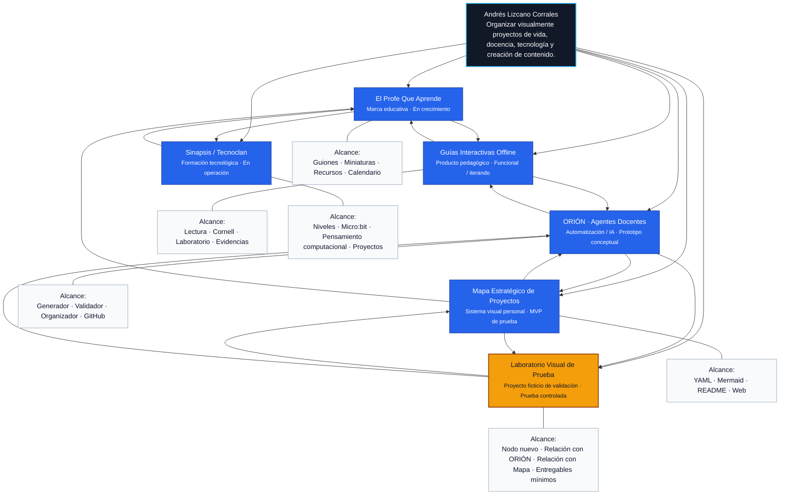

# Mapa Estratégico de Proyectos

Sistema visual para convertir proyectos, alcances, entregables y relaciones en un mapa conceptual vivo.

> MVP de prueba creado para validar la idea antes de cargar los proyectos reales de ChatGPT.

## Vista rápida



## Prueba realizada

Se agregó el proyecto ficticio **Laboratorio Visual de Prueba** para comprobar que el sistema puede:

- Recibir un proyecto nuevo desde `projects.yml`.
- Crear un nodo visual en Mermaid.
- Conectar ese nodo con otros proyectos.
- Mostrar alcance y entregables sin tocar todavía los proyectos reales.

## ¿Cómo se usa?

1. Edita `projects.yml`.
2. Agrega o ajusta proyectos, alcances, entregables y relaciones.
3. El flujo del repositorio actualiza `docs/mapa.mmd`.
4. Abre este `README.md` para ver el mapa Mermaid renderizado por GitHub.
5. Abre `docs/index.html` para una vista web más visual.

## Estructura del repositorio

```text
.
├── README.md
├── projects.yml
├── docs/
│   ├── index.html
│   └── mapa.mmd
├── scripts/
│   └── generate_mermaid.py
└── .github/
    └── workflows/
        └── build-map.yml
```

## Próximo nivel

La versión inicial permite validar la idea. La siguiente evolución puede incluir:

- Dashboard con estados, prioridades y porcentaje de avance.
- Filtros por proyecto: docencia, contenido, software, vida personal, ingresos.
- Exportación a imagen o PDF.
- Integración futura con agentes para actualizar el mapa desde conversaciones.

## Nota sobre MCP

Este repositorio no es un MCP por sí mismo. Puede convertirse en parte de un sistema más amplio donde un agente lea tus proyectos, actualice archivos y genere visualizaciones. En ese escenario, el repositorio sería la memoria estructurada y la interfaz visual del sistema.
