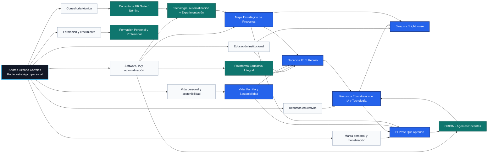

# Mapa Estratégico de Proyectos

Radar visual para organizar los proyectos de **Andrés Lizcano Corrales**: docencia, recursos educativos, IA, marca personal, Sinapsis, formación, vida familiar, consultoría y automatización.

> Versión real inicial. Se retiró el nodo ficticio de prueba y se cargó la estructura refinada a partir de la conversación del 2 de septiembre de 2026.

## Vista conceptual



## Proyectos cargados

| Proyecto | Área | Estado | Prioridad |
|---|---|---:|---:|
| Docencia IE El Recreo | Educación institucional | Activo permanente | Alta |
| Recursos Educativos con IA y Tecnología | Recursos educativos | Activo | Alta |
| ORIÓN · Agentes Docentes | Software, IA y automatización | Conceptual / en diseño | Media |
| El Profe Que Aprende | Marca personal y monetización | Activo estratégico | Alta |
| Sinapsis / Lighthouse | Educación institucional | En operación | Alta |
| Plataforma Educativa Integral | Software, IA y automatización | Idea avanzada | Media |
| Formación Personal y Profesional | Formación y crecimiento | Activo | Media |
| Vida, Familia y Sostenibilidad | Vida personal y sostenibilidad | Activo permanente | Alta |
| Tecnología, Automatización y Experimentación | Software, IA y automatización | Activo | Media |
| Consultoría HR Suite / Nómina | Consultoría técnica | Ocasional | Media |
| Mapa Estratégico de Proyectos | Software, IA y automatización | En construcción | Alta |

## Corrección aplicada

Los juegos estudiantiles de **Martín, Samantha, Emanuel y otros estudiantes** pertenecen a **Sinapsis / Lighthouse**, no al proyecto de recursos del colegio.

## Estructura del repositorio

```text
.
├── README.md
├── projects.yml
├── docs/
│   ├── index.html
│   └── mapa.mmd
├── scripts/
│   └── generate_mermaid.py
└── data/
    ├── avances.yml
    ├── pendientes.yml
    ├── decisiones.yml
    └── bloqueos.yml
```

## Cómo se usa

1. Editar `projects.yml`.
2. Ajustar proyectos, categorías, relaciones, prioridades o próximas acciones.
3. Ejecutar `python scripts/generate_mermaid.py` o dejar que GitHub Actions regenere `docs/mapa.mmd`.
4. Abrir `docs/index.html` para usar la vista filtrable.

## Campos principales

```yaml
id:
nombre:
area_principal:
categoria:
tipo:
estado:
prioridad:
objetivo:
alcance:
subproyectos:
acciones_recurrentes:
entregables:
dolores:
siguiente_accion:
relaciones:
```

## Siguiente evolución

La siguiente fase es alimentar `data/avances.yml`, `data/pendientes.yml`, `data/decisiones.yml` y `data/bloqueos.yml` desde el cierre diario programado de ChatGPT.
